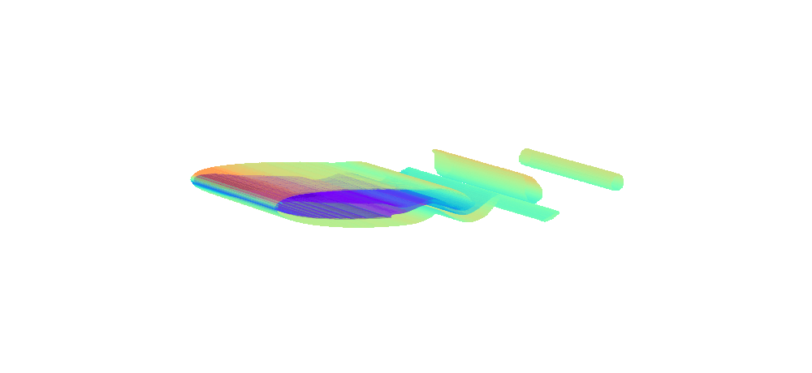

<p align="center">
    <a href="./docs/images/logo_lm.png#gh-light-mode-only">
        
    </a>
    <a href="./docs/images/logo_dm.png#gh-dark-mode-only">
        
    </a>
</p>

<table style="border-collapse: collapse; border: none;">
  <tr>
    <td style="border: none; padding: 0;">
      
    </td>
    <td style="border: none; padding: 0;">
      
    </td>
    <td style="border: none; padding: 0;">
      
    </td>
    <td style="border: none; padding: 0;">
      
    </td>
  </tr>
</table>

<div align="center">
    
[](https://badge.fury.io/py/fluidgym)


[](https://github.com/safe-autonomous-systems/fluidgym/actions/workflows/linters.yml)
    
</div>

<div align="center">
    <h3>
      <a href="#-installation">Installation</a> |
      <a href="#-getting-started">Getting Started</a> |
      <a href="https://safe-autonomous-systems.github.io/fluidgym">Documentation</a> | 
      <a href="#-license-&-citation">License & Citation</a>
    </h3>
</div>

---

## Key Features

- **Standalone, GPU-accelerated fluid dynamics** implemented fully in PyTorch — no external CFD solvers required.
- **Fully differentiable environments**, enabling both reinforcement learning and gradient-based control methods.
- **Gymnasium-like API** with seamless integration into common RL frameworks.
- **Standardized benchmarks** with fixed train/validation/test splits for fair and reproducible evaluation.
- **Diverse AFC environments** (2D & 3D) with multiple difficulty levels, covering different regimes.
- **Single-agent and multi-agent support** for centralized and decentralized control.
- **Reference baselines and experiments** provided for widely used RL algorithms PPO and SAC.

### Models & Data
- **All trained models** are publicly available on [HuggingFace](https://huggingface.co/collections/safe-autonomous-systems/fluidgym-benchmark-models).
- **Complete training and test datasets** with results for all experimental runs are released for transparent comparison and reproducibility via our [HuggingFace dataset](https://huggingface.co/datasets/safe-autonomous-systems/fluidgym-experiments).

---

## Installation

### 📦 Installation from PyPi

1. Ensure the correct PyTorch version is installed (compatible with CUDA 12.8):
```bash
pip install torch --index-url https://download.pytorch.org/whl/cu128
```

2. Install 

```bash
pip install fluidgym
```

### 🐳 Using Docker

Instead of installing FluidGym you can use one of our Docker containers:

- [fluidgym-runtime](https://hub.docker.com/repository/docker/becktepe/fluidgym-runtime) for running FluidGym
- [fluidgym-devel](https://hub.docker.com/repository/docker/becktepe/fluidgym-devel) for development

Both containers come with the following Miniconda environments:
- ```py310```: Python 3.10
- ```py311```: Python 3.11
- ```py312```: Python 3.12
- ```py313```: Python 3.13

Start the containers with:
```bash
docker run -it --gpus all fluidgym-runtime bash
docker run -it --gpus all fluidgym-devel bash
```

### 🧱 Build from Source

1. Create a new conda environment and activate it:
```bash
conda create -n fluidgym python=3.10
conda activate fluidgym
```

2. Install gcc:
```bash
conda install pip "gcc_linux-64>=6.0,<=11.5" "gxx_linux-64>=6.0,<=11.5"
```

3. Install the latest Pytorch for CUDA 12.8 via pip:
```bash
pip install torch --index-url https://download.pytorch.org/whl/cu128
```

4. Install the matching cuda toolkit via conda:
```bash
conda install cuda-toolkit=12.8 -c nvidia/label/cuda-12.8.1
```

5. Clone the repository and enter the directory, then compile the custom CUDA kernels and install the package (this might take several minutes):
```bash
make install
```

## Getting Started

For an easy start refer to our [documentation](https://safe-autonomous-systems.github.io/fluidgym/) and the [`examples`](examples) directory.
FluidGym provides a ```gymnasium```-like interface that can be used as follows:

```python
import fluidgym

env = fluidgym.make(
    "JetCylinder2D-easy-v0",
)
obs, info = env.reset(seed=42)

for _ in range(50):
    action = env.sample_action()
    obs, reward, term, trunc, info = env.step(action)
    env.render()

    if term or trunc:
        break
```

## License & Citation

This repository is published under the MIT license. If you use FliudGym in your work, please cite us:

```bibtex
@misc{becktepe-fluidgym26,
      title={Plug-and-Play Benchmarking of Reinforcement Learning Algorithms for Large-Scale Flow Control}, 
      author={Jannis Becktepe and Aleksandra Franz and Nils Thuerey and Sebastian Peitz},
      year={2026},
      eprint={2601.15015},
      archivePrefix={arXiv},
      primaryClass={cs.LG},
      url={https://arxiv.org/abs/2601.15015}, 
      note={GitHub: https://github.com/safe-autonomous-systems/fluidgym}, 
}
```
